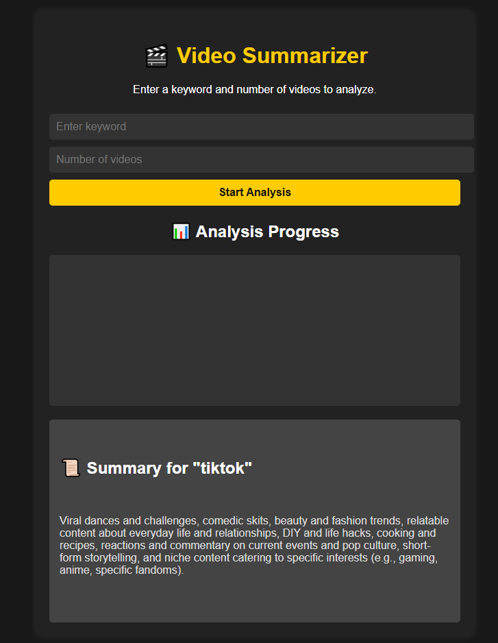

# TikTok Video Summarizer

## Overview

This project automates the process of fetching TikTok videos based on a given keyword, downloading them, generating textual descriptions, storing the descriptions in Google BigQuery, and finally summarizing the key discussion topics using **Gemini AI**. It provides a **modern web interface** where users can input a keyword and the number of videos to analyze. The **real-time progress** is displayed via **WebSockets**, and the final results are **rendered in Markdown format**.

## Features

- 🌟 **Fetch TikTok videos** based on a specific keyword via **TikAPI**
- 🎬 **Download and analyze only the requested number of videos**
- 📝 **Generate video descriptions** using **Gemini AI**
- 📊 **Store descriptions** in **Google BigQuery**
- 🔥 **Summarize trending topics** using **Gemini AI**
- 🖥 **Web UI with Markdown rendering**
- 🚀 **Real-time progress updates** using WebSockets
- ☁️ **Deployable on Google Cloud Run**
- ✅ **Provide Grounding and evaluate summary accuracy using structured precision and recall metrics**

---

## Requirements

Before running the project, ensure you have the following:

- ✅ A valid **TikAPI** key for fetching TikTok videos
- ✅ A **Google Cloud Platform (GCP)** project with **BigQuery** enabled
- ✅ A **Gemini AI** API key
- ✅ **Docker & gcloud CLI** installed for deployment
- ✅ A `.env` file containing the required credentials:

### ``** File**

```ini
TIKAPI_KEY=your_tikapi_key
GEMINI_KEY=your_gemini_api_key
GCP_PROJECT_ID=your_gcp_project_id
BQ_DATASET_ID=your_bigquery_dataset_id
```

---

## Installation (Local Setup)

### **1️⃣ Clone the Repository**

```sh
git clone https://github.com/your-repo/tiktok-summarizer.git
cd tiktok-summarizer
```

### **2️⃣ Create and Activate a Virtual Environment**

```sh
python -m venv .venv
source .venv/bin/activate  # On macOS/Linux
.venv\Scripts\activate    # On Windows
```

### **3️⃣ Install Dependencies**

```sh
pip install -r requirements.txt
```

### **4️⃣ Run the FastAPI Web App**

```sh
uvicorn app:app --host 0.0.0.0 --port 8080
```

Visit [**http://127.0.0.1:8080**](http://127.0.0.1:8080) in your browser to use the web interface.

---

## Usage (Web UI)

1️⃣ Open the **Web UI** in your browser.\
2️⃣ Enter a **keyword** and the number of videos to analyze.\
3️⃣ Click **"Start Analysis"** to begin processing.\
4️⃣ **Real-time progress** will be displayed as videos are fetched, analyzed, and deleted.\
5️⃣ The **final summary** will be displayed in a **Markdown-styled** format.

---

## Command-line Usage

Alternatively, you can run the script via the command line:

```sh
python main.py --keyword "NBA" --minimal_video_number 40
```

### **Available Arguments**

- `--keyword` (**required**): The keyword to fetch videos for.
- `--minimal_video_number` (**optional**, default=40): The number of videos to process.

---

## Deployment on Google Cloud Run

This project is **fully deployable** on **Google Cloud Run** with **Docker**.

### **1️⃣ Build the Docker Image**

```sh
docker build -t fastapi-video-summarizer .
```

### **2️⃣ Run the Image Locally (Optional)**

```sh
docker run -p 8080:8080 fastapi-video-summarizer
```

### **3️⃣ Push the Image to Google Artifact Registry**

```sh
gcloud auth configure-docker us-central1-docker.pkg.dev
docker tag fastapi-video-summarizer us-central1-docker.pkg.dev/YOUR_PROJECT_ID/video-summarizer/video-summarizer
docker push us-central1-docker.pkg.dev/YOUR_PROJECT_ID/video-summarizer/video-summarizer
```

### **4️⃣ Deploy to Cloud Run**

```sh
gcloud run deploy fastapi-video-summarizer \
  --image us-central1-docker.pkg.dev/YOUR_PROJECT_ID/video-summarizer/video-summarizer \
  --platform managed \
  --region us-central1 \
  --allow-unauthenticated
```

Once deployed, **Google Cloud Run** will provide a **public URL** for the web application.

---

## Workflow

1️⃣ **Fetch TikTok Videos** – Queries TikAPI for videos based on the specified keyword.\
2️⃣ **Download Videos** – Only downloads the requested number of videos.\
3️⃣ **Generate Descriptions** – Uses **Gemini AI** to summarize each video.\
4️⃣ **Store in BigQuery** – Inserts descriptions into BigQuery for future analysis.\
5️⃣ **Summarize Key Topics** – Uses **Gemini AI** to generate a final summary.\
6️⃣ **Delete Processed Videos** – Deletes each video after processing to optimize storage.\
7️⃣ **Evaluate summary accuracy** - Tell how good the final summary is. \
8️⃣ **Display Final Summary** – Renders the final analysis as Markdown in the Web UI.
---

## Screenshots

### 🎬 **Web UI**



---
